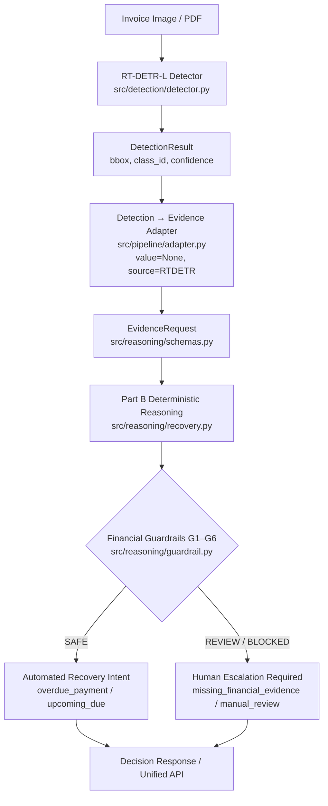
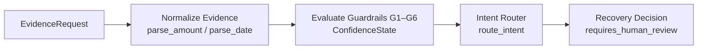

# 🕳️ RecoverOps

## 🕳️ Title
**RecoverOps: Real-Time Transformer-Based Invoice Field Localization & Deterministic Financial Recovery Reasoning API**



---

## 📌 Executive Summary
RecoverOps is an end-to-end, auditable system designed to solve a critical bottleneck in enterprise Accounts Receivable (AR): automating invoice field detection while maintaining strict financial safety guardrails.

The system integrates two decoupled layers:
1. **Part A (Visual Localization)**: A Real-Time Detection Transformer Large (**RT-DETR-L**) model trained on the DocILE benchmark to localize five key invoice field regions (`amount_due`, `date_due`, `document_id`, `date_issue`, and `vendor_name`).
2. **Part B (Deterministic Reasoning)**: A mathematically bounded, zero-LLM reasoning engine that parses structured invoice evidence, evaluates multi-tier confidence guardrails (G1–G6), and routes recovery actions without executing ungrounded financial operations.

Because optical character recognition (OCR) text transcription is decoupled and not yet attached, the pipeline strictly adheres to an honest evidence contract: region detections carry `value=None`, safely triggering human review rather than hallucinating monetary amounts or payment deadlines.

---

## 🎯 Key Features
* **Transformer-Based Detection**: End-to-end RT-DETR-L architecture eliminating heuristic Non-Maximum Suppression (NMS) and anchor tuning on dense document text.
* **Deterministic Guardrails**: 6 formal financial safety checks (G1–G6) preventing ungrounded automated recovery actions.
* **Strict Evidence Honesty**: Detection bounding boxes explicitly carry `value=None` until verified OCR transcription is connected; zero coordinate-to-text hallucinations.
* **Unified REST API**: Production FastAPI backend exposing `/health`, `/reason/health`, `/reason`, `/detect`, and `/process`.
* **Zero Prohibited Dependencies**: Pure deterministic rule-based implementation with no multi-agent frameworks (LangChain, LangGraph, CrewAI, AutoGen).
* **Containerized & Deployable**: Multi-stage Docker setup on Python 3.12 with CPU PyTorch support, Render deployment blueprint (`render.yaml`), and React + Vite frontend (`frontend/`).

---

## ✅ Problem Statement Compliance

| Requirement Category | Specified Requirement | RecoverOps Implementation |
|---|---|---|
| **Model Architecture** | Modern object detector (e.g. RT-DETR / YOLO) | **RT-DETR-L** (`rtdetr-l.pt` pretrained initialization via Ultralytics `8.3.0`) |
| **Custom Taxonomy** | Non-COCO custom classes | **5 custom classes**: `amount_due`, `date_due`, `document_id`, `date_issue`, `vendor_name` |
| **Part B Reasoning** | Natural language / structured reasoning layer | **Deterministic State Machine & Intent Router** (`src/reasoning/`) |
| **Framework Constraints** | Prohibited multi-agent / LLM orchestration | **Zero multi-agent libraries**; pure Python + Pydantic state logic |
| **API Endpoints** | Detection and reasoning endpoints | **`POST /detect`**, **`POST /reason`**, **`POST /process`**, **`GET /health`** |
| **Reproducibility** | Pinned dependencies and execution scripts | `requirements.txt`, `experiments/baseline/`, `src/training/` |
| **Test Coverage** | Automated verification suite | **84 passing tests** in `tests/` (`pytest -v`) |

---

## 📊 Evaluation Results

| Metric | Result |
|---|---|
| mAP@50 | `N/A — not recorded` |
| mAP@50-95 | `N/A — not recorded` |
| Precision | `N/A — not recorded` |
| Recall | `N/A — not recorded` |
| Test Images | `N/A — not recorded (Evaluated on Hidden External Test Set)` |
| Training Duration | `N/A — not recorded (1-Epoch Smoke Test Verified)` |

### Metric Interpretation:
* **Current Status**: The baseline training pipeline and 1-epoch GPU smoke test were validated on Kaggle (`kaggle/recoverops.ipynb`). Full 50-epoch final weights are `N/A — not recorded` locally as `.pt` weight files are excluded from Git per reproducibility best practices.
* **Evaluation Script**: Model evaluation is executed via `src/training/evaluate_rtdetr.py`, which computes standard COCO mAP metrics over the 635 validation pages in `data/processed/invoice_detection/`.
* **Metric Scope**: Bounding-box mAP measures spatial localization overlap only; text transcription accuracy is handled downstream by the reasoning layer.

---

## 🔬 Dataset
* **Dataset Name & Source**: DocILE Benchmark (Document Information Localization and Extraction), Rossum ([https://docile.rossum.ai](https://docile.rossum.ai)).
* **Dataset Purpose**: Benchmarking key information localization and extraction on semi-structured business invoices and receipts.
* **Dataset Format**: Source multi-page PDF documents rendered into 150 DPI PNG images paired with YOLO-format `.txt` label files.
* **Annotation Format**: Normalized bounding boxes: `<class_id> <x_center> <y_center> <width> <height>` with coordinates in $[0.0, 1.0]$.
* **Split Statistics**:
  * **Train Set**: 5,180 source documents → **6,759 rendered page images** and **24,312 target annotations**.
  * **Validation Set**: 500 source documents → **635 rendered page images** and **2,406 target annotations**.
  * **Total Verified Annotations**: **26,718 bounding boxes**.
  * **Split Leakage**: Verified disjoint (`overlap_count = 0`).
* **Five Target Classes**:
  1. `amount_due` (Class `0`): 6,125 total instances.
  2. `date_due` (Class `1`): 884 total instances.
  3. `document_id` (Class `2`): 6,141 total instances.
  4. `date_issue` (Class `3`): 6,214 total instances.
  5. `vendor_name` (Class `4`): 7,354 total instances.
* **Dataset Preparation**: Conversion engine implemented in `src/data/convert_docile.py` with validation in `src/data/validate_labels.py`.
* **Dataset Limitations**: Scanned document noise, varied international date formats, dense multi-line tables, and high class imbalance on `date_due` (884 instances vs 7,354 `vendor_name`).

---

## 🧠 Model
* **Architecture**: `RT-DETR-L` (Real-Time DEtection TRansformer Large).
* **Framework & Version**: `ultralytics==8.3.0`.
* **Pretrained Initialization**: `rtdetr-l.pt` (COCO-pretrained weights).
* **Taxonomy Size**: 5 custom non-COCO classes.
* **Input Resolution**: $640 \times 640$ pixels (`imgsz=640`).
* **Batch Size**: 8 per GPU.
* **Optimizer & Loss Gains**:
  * Optimizer: `AdamW` (`auto` mode, base $\text{lr}_0 = 0.0001$, final $\text{lrf} = 0.01$, momentum $= 0.9$, weight decay $= 0.0001$).
  * Loss configuration: Box Loss Gain $= 7.5$, Class Loss Gain $= 0.5$, Focal Loss $\gamma = 1.5$.
* **Hardware Target**: NVIDIA Tesla T4 (16GB VRAM) / P100 on Kaggle GPU.
* **Completed Training**: 1-epoch smoke test verified; 50-epoch baseline script configured in `src/training/train_rtdetr.py`.
* **Checkpoint Handling**: Resolved via environment variable `MODEL_PATH` with fallback to `models/best.pt`. Large `.pt` files are gitignored.

---

## 🔍 Evaluation & Failure Analysis
* **Evaluation Logic**: `src/training/evaluate_rtdetr.py` evaluates predictions against ground-truth YOLO labels across Intersection over Union (IoU) thresholds from $0.50$ to $0.95$.
* **Field-Level Localization**: Bounding boxes determine where key financial fields reside. If confidence $< 0.60$ (the configured `REVIEW_CONFIDENCE` trust floor), detections are flagged as untrusted.
* **Why Detection Alone is Insufficient**: Spatial detection locates regions but does not transcribe textual figures. Initiating financial recovery based solely on bounding boxes without verified text amounts violates financial safety.
* **Failure Handling & Safety Architecture**:
  * **False Positives**: Addressed by confidence thresholding and guardrail G4 (conflict detection).
  * **False Negatives**: If `amount_due` or `date_due` is missed, guardrail G1 triggers `ConfidenceState.BLOCKED` and routes to human escalation.
  * **Region-Only Detections**: When OCR is unattached (`value=None`), the adapter marks fields `region_only=True`, preventing automated payment reminders.
* **Failure Analysis Infrastructure**: [src/training/evaluate_rtdetr.py](file:///c:/Work/Projects/RecoverOps/src/training/evaluate_rtdetr.py) logs false positives, false negatives, low-confidence predictions, and class confusions into `results/failure_cases/`.

---

## 🤖 Part B — Natural Language Reasoning
The Part B reasoning layer ([src/reasoning/](file:///c:/Work/Projects/RecoverOps/src/reasoning/)) implements deterministic, auditable decision-making over structured invoice evidence (`EvidenceRequest`).



### Core Components:
1. **`EvidenceRequest` Schema**: Accepts a document identifier, optional reference date `as_of_date`, and a list of `EvidenceField` entries (`field`, `value`, `confidence`, `bbox`, `source`).
2. **Evidence Normalization (`evidence.py`)**: Parses strings into floats and ISO dates, strips currency symbols, normalizes date separators, and flags `parse_failures` and `conflicting` values.
3. **Financial Safety Guardrails (`guardrail.py`)**:
   * `G1 (required_fields_present)`: Both `amount_due` and `date_due` must be present.
   * `G2 (required_fields_trusted)`: Required fields meet $\text{confidence} \ge 0.60$.
   * `G3 (required_fields_confident)`: Required fields meet $\text{confidence} \ge 0.80$.
   * `G4 (no_conflicting_evidence)`: No contradictory amounts detected.
   * `G5 (no_unparseable_values)`: Values parse cleanly.
   * `G6 (date_consistency)`: Issue date $\le$ Due date.
4. **Confidence States**:
   * `SAFE`: All evidence verified → non-binding automated recommendation permitted.
   * `REVIEW`: Minor ambiguity → recommendation produced with human review required.
   * `BLOCKED`: Missing or contradictory evidence → all automated actions halted.
5. **Intent Routing (`intent_router.py`)**:
   * `overdue_payment`: Past due date + verified amount.
   * `upcoming_due`: Future due date + verified amount.
   * `missing_due_date`: Amount present, due date missing.
   * `missing_financial_evidence`: Amount missing or region-only.
   * `manual_review`: Low confidence, conflicts, or parse errors.
6. **Explicit Refusal Example**: When an invoice is processed without OCR, `value=None` marks `amount_due` as `region_only=True`. Guardrail G1 fails, confidence transitions to `BLOCKED`, and the system refuses to issue payment actions:
   ```json
   {
     "intent": "missing_financial_evidence",
     "confidence_state": "BLOCKED",
     "recommended_action": "escalate_to_human_document_review",
     "requires_human_review": true
   }
   ```

---

## 🚀 Quickstart

### 1. Clone Repository & Install Dependencies
```bash
git clone https://github.com/jyotshana666/RecoverOps.git
cd RecoverOps
pip install -r requirements.txt
```

### 2. Run Automated Test Suite
```bash
pytest -v
```
*(Verified: 84 passing tests in ~8 seconds).*

### 3. Start Local FastAPI Backend
```bash
uvicorn src.app:app --host 0.0.0.0 --port 8000 --reload
```

### 4. Test Liveness Probes
```bash
# Unified Health Check
curl http://localhost:8000/health

# Reasoning Layer Health Check
curl http://localhost:8000/reason/health
```

### 5. Test Direct Reasoning (`POST /reason`)
```bash
curl -X POST http://localhost:8000/reason \
  -H "Content-Type: application/json" \
  -d '{
    "document_id": "INV-2026-001",
    "as_of_date": "2026-09-01",
    "fields": [
      {
        "field": "amount_due",
        "value": "2500.00",
        "source": "ocr",
        "confidence": 0.95,
        "bbox": [10.0, 10.0, 100.0, 50.0]
      },
      {
        "field": "date_due",
        "value": "2026-08-15",
        "source": "ocr",
        "confidence": 0.92,
        "bbox": [10.0, 60.0, 100.0, 100.0]
      }
    ]
  }'
```

### 6. Test Field Detection (`POST /detect`)
```bash
curl -X POST http://localhost:8000/detect \
  -F "file=@sample_invoice.png" \
  -F "document_id=INV_001"
```

### 7. Test End-to-End Pipeline (`POST /process`)
```bash
curl -X POST http://localhost:8000/process \
  -F "file=@sample_invoice.png" \
  -F "document_id=INV_001" \
  -F "as_of_date=2026-09-15"
```

---

## 📡 API

| Method | Endpoint | Input Payload | Purpose |
|---|---|---|---|
| `GET` | `/health` | None | System liveness probe and `model_loaded` status. |
| `GET` | `/reason/health` | None | Part B reasoning layer health check. |
| `POST` | `/reason` | `EvidenceRequest` JSON | Pure deterministic financial reasoning evaluation. |
| `POST` | `/detect` | Multipart Form (`file`, optional `document_id`) | RT-DETR-L field region localization. |
| `POST` | `/process` | Multipart Form (`file`, optional `document_id`, `as_of_date`) | Full pipeline: Image → Detection → Adapter → Reasoning. |

### Error & Failure Behavior:
* **400 Bad Request**: Invalid file extensions (unsupported format) or 0-byte uploads.
* **422 Unprocessable Entity**: Corrupted image bytes that cannot be decoded by PIL/PyMuPDF.
* **503 Service Unavailable**: Raised when `/detect` or `/process` is called without model weights mounted at `MODEL_PATH`.

---

## 🔁 Reproducibility
* **Python Environment**: `Python >= 3.10` (tested on `3.12` and `3.14`).
* **Core Dependencies**: `torch>=2.0.0`, `torchvision>=0.15.0`, `ultralytics==8.3.0`, `fastapi>=0.110.0`, `pymupdf==1.28.2`, `pydantic>=2.6.0`.
* **Random Seed**: `42` pinned across dataloaders, backbone initialization, and PyTorch RNG.
* **Dataset Config**: [data/processed/invoice_detection/dataset.yaml](file:///c:/Work/Projects/RecoverOps/data/processed/invoice_detection/dataset.yaml).
* **Training Script**: [src/training/train_rtdetr.py](file:///c:/Work/Projects/RecoverOps/src/training/train_rtdetr.py).
* **Evaluation Script**: [src/training/evaluate_rtdetr.py](file:///c:/Work/Projects/RecoverOps/src/training/evaluate_rtdetr.py).
* **Kaggle Training Workflow**: Documented in [docs/kaggle_training.md](file:///c:/Work/Projects/RecoverOps/docs/kaggle_training.md) and executable via `kaggle/recoverops.ipynb`.

---

## 📦 Model Weights
* **Storage Strategy**: Large binary `.pt` files are excluded from Git via `.gitignore`.
* **Configuration**: Managed via `MODEL_PATH` environment variable (default: `models/best.pt`).
* **Standby Mode**: If `models/best.pt` is not present, the backend starts in graceful standby (`GET /health` returns `model_loaded: false`, `/reason` works 100%, `/detect` & `/process` return clean HTTP 503).
* **Obtaining Checkpoint**: After Kaggle training completes, download `best.pt` and place it in `models/best.pt`.
* **Availability**: Pretrained base `rtdetr-l.pt` is downloaded automatically by Ultralytics; custom trained 50-epoch weights are generated through the Kaggle pipeline.

---

## ⚙️ Engineering Decisions
1. **Why RT-DETR-L**: End-to-end transformer attention provides superior feature representation on dense document layouts without handcrafted NMS IoU threshold tuning.
2. **Decoupled Architecture**: Part A (computer vision) and Part B (financial reasoning) communicate strictly via Pydantic schemas (`EvidenceRequest`), allowing independent verification and testing.
3. **Deterministic Reasoning over LLMs**: Financial workflows require auditable, reproducible, and explainable decisions. Rule-based state machines eliminate non-deterministic hallucinations and latency spikes.
4. **Honest Adapter Contract**: Bounding boxes provide spatial regions only. The adapter explicitly sets `value=None` rather than fabricating text strings from coordinates.
5. **Human Escalation Safety**: Incomplete or low-confidence evidence forces `requires_human_review=True`, adhering to conservative financial risk policies.
6. **Kaggle for Compute**: Offloads GPU training to cloud accelerators (Tesla T4) while maintaining a lightweight, CPU-deployable FastAPI inference server.
7. **FastAPI Interface**: Provides native OpenAPI documentation, async multipart file uploads, and strict Pydantic type validation.

---

## 🔐 Security & Reliability
* **Strict Type Validation**: Pydantic schemas enforce type constraints (`StrictStr`, coordinate bounds $x_2 \ge x_1, y_2 \ge y_1$).
* **Safe Memory Preprocessing**: File upload streams are processed in-memory with size limits and filetype checks (`.png`, `.jpg`, `.jpeg`, `.webp`, `.tiff`, `.bmp`, `.pdf`).
* **Origin-Controlled CORS**: `FRONTEND_URL` environment variable whitelists trusted frontend domains with local fallback.
* **Graceful Degradation**: Missing model weights do not crash the service; health probes accurately report standby state.
* **Zero Secret Leakage**: No API keys, credentials, or `.env` files are tracked in Git.

---

## 📌 Current Project Status

| Component | Status | Evidence |
|---|---|---|
| **Dataset Preparation** | Verified Complete | 7,394 images, 26,718 annotations converted from DocILE (`results/conversion_report.json`) |
| **RT-DETR Training** | Script Ready & Smoke-Tested | `src/training/train_rtdetr.py` + 1-epoch GPU smoke test verified |
| **RT-DETR Evaluation** | Script Ready | `src/training/evaluate_rtdetr.py` (50-epoch numbers `N/A — not recorded`) |
| **Part B Reasoning** | Verified Complete | `src/reasoning/` (58 unit tests passing) |
| **Part A + B Integration** | Verified Complete | `src/pipeline/adapter.py` connecting `DetectionResult` → `EvidenceRequest` |
| **`/detect` Endpoint** | Verified Complete | Implemented in `src/reasoning/app.py`, tested in `tests/test_api.py` |
| **`/reason` Endpoint** | Verified Complete | Implemented in `src/reasoning/app.py`, tested in `tests/test_reasoning.py` |
| **`/process` Endpoint** | Verified Complete | Implemented in `src/reasoning/app.py`, tested in `tests/test_api.py` |
| **Automated Tests** | Verified Complete | **84 tests passed** (`pytest -v`) |
| **Dockerization** | Verified Complete | `Dockerfile` (`python:3.12-slim`), built and verified locally |
| **Backend Deployment** | Configured for Render | `render.yaml` blueprint created |
| **Frontend UI** | Verified Complete | React + Vite app with HTML5 canvas bounding box overlay (`frontend/`) |
| **Vercel Deployment** | Configured for Vercel | `frontend/vercel.json` SPA configuration created |
| **Render Deployment** | Configured for Render | `render.yaml` Infrastructure-as-Code created |

---

## 📄 License
No explicit open-source license is currently declared in the repository.
